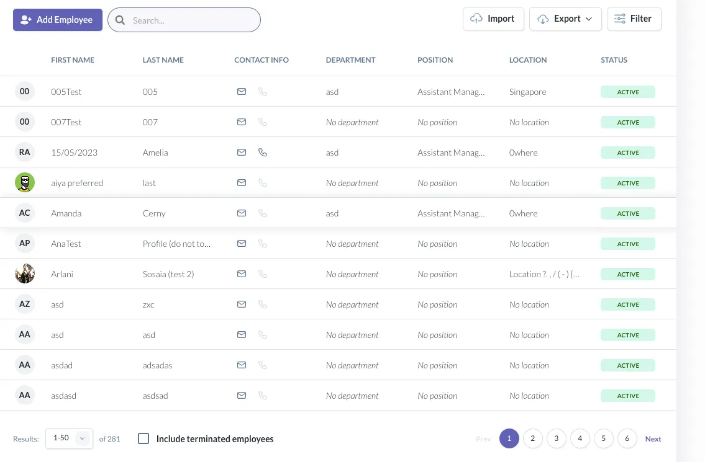

🗒️ **Note:** 
* Collumns: `First Name`, `Last Name`, `Contact Info`, `Department`, `Position`, `Location`, `Status`
* Adding collumn `Company` because there is a filter of option for company


### Dynamic columns :

### Performance :

### Rate-limitting

# Deliverables


# Example:
Request:

```bash
curl -X 'GET' \
  'http://localhost:8000/employees/search?status_id=2&page=1&size=2' \
  -H 'accept: application/json' \
  -H 'X-ORG-KEY: key-workday-001'
```

Response:

```bash
{
  "page": 1,
  "size": 2,
  "total": 166473,
  "total_pages": 83237,
  "data": [
    {
      "first_name": "Christopher",
      "last_name": "Romero",
      "company": "Zion Technologies"
    },
    {
      "first_name": "Max",
      "last_name": "Frey",
      "company": "Illuminati Holdings"
    }
  ]
}
```